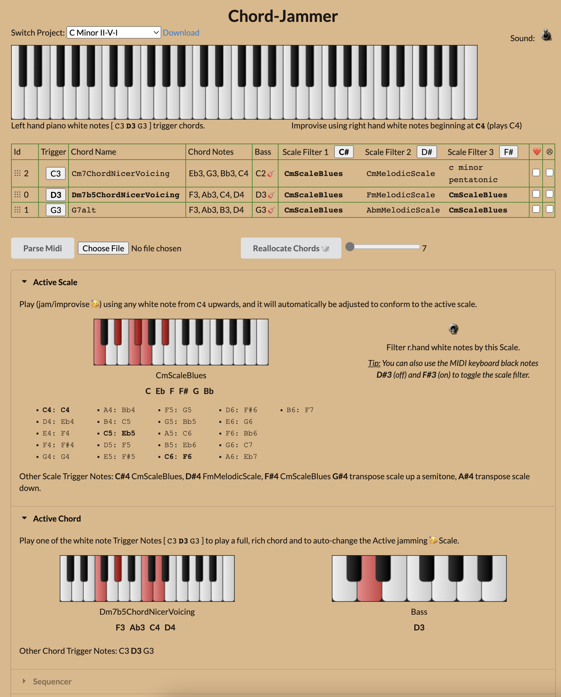

# OneKeyJam Project

A midi web app that lets you play chords with 1 finger in the left hand
and jam safely in the right hand.

As you change chords, the rh notes are filtered so you always play good sounding notes.

## Running

    npm run dev

which runs Vite on port 8080. The `predev` script generates the project and
keyboard manifests first, so the static libraries are listed in the UI.

Then visit http://localhost:8080/index.html.

## Screenshot


<br>
<br>

# Quick Summary

OneKeyJam is a fully client-side static site. It has no backend: the featured
project library and keyboard configs are static JSON files under `public/`, and
projects you save are kept in your browser with IndexedDB. You can export and
import projects as JSON files to back them up or move them between browsers.

> History: the app formerly used Firebase (Firestore, Auth and Cloud Functions)
> and the Stripe `firestore-stripe-payments` extension for a paid tier. Firebase
> and Stripe were removed so the app can be hosted for free with no billing
> risk. See doco/STRIPE-DEPRECATION-HISTORY.md for why the extension was
> retired.

## How to run the project

- `npm run dev` (`bin/run`) — Vite dev server on port **8080**
- `npm run build` — production build into `dist/`, ready for static hosting

Then visit `http://localhost:8080/index.html`. Tests: `npm run test:unit` (Vitest) and `npm test` (Mocha).

## How it deploys to Netlify

The app is a static site. Netlify builds it and serves the `dist` folder (see `netlify.toml`). The SPA fallback redirect makes deep links such as `/perform` resolve to `index.html`.

1. `npm run build`
2. Deploy with the Netlify CLI (`netlify deploy --prod`), or connect the Git repository and let Netlify run `npm run build` with `publish = dist`.

The `prebuild` script generates the manifests automatically, so no extra build step is needed on Netlify.

# Detailed Notes

## Deploying to Heroku

https://stackoverflow.com/questions/69444225/how-do-i-deploy-to-heroku-using-vite?answertab=trending#tab-top

```bash
heroku create -a onekeyjam
heroku config:set I_AM_ON_HEROKU=1
heroku buildpacks:clear
heroku buildpacks:add heroku/jvm
heroku buildpacks:add heroku/nodejs
heroku buildpacks:add https://github.com/heroku/heroku-buildpack-static.git
git push heroku main
```

The heroku-buildpack-static buildpack will make sure that your app is treated as a static page rather than a node js application.

Add a file to the root of your Vite project called static.json
```json
{
  "root": "./dist",
  "clean_urls": true,
  "routes": {
    "/**": "index.html"
  }
}
```

### diagnostics
```
heroku buildpacks
heroku buildpacks:clear  (you can use heroku buildpacks:set xxx to both clear and then add)
heroku logs -t
heroku config
heroku run bash
```


## Deploying to Dokku (NAS)

```bash
ssh dokku.nas
dokku apps:list
dokku apps:create onekeyjam
dokku config:set onekeyjam I_AM_ON_HEROKU=1

dokku buildpacks:clear onekeyjam
dokku buildpacks:report onekeyjam
dokku buildpacks:add onekeyjam https://github.com/heroku/heroku-buildpack-jvm-common.git
dokku buildpacks:add onekeyjam heroku/nodejs
dokku buildpacks:add onekeyjam https://github.com/heroku/heroku-buildpack-static.git
```

locally run

```bash
git remote add nas dokku@dokku.nas:onekeyjam
git push nas main
```

Add `192.168.0.16    onekeyjam.dokku.nas` to `%WinDir%\System32\Drivers\Etc\hosts`

Visit http://onekeyjam.dokku.nas/

P.S. Info on [Java buildpack problems](research/dokku-java-experiments/java-attempts.md) 


### Won't run sound/MIDI on NAS ?  No https, that's why

> Note: navigator.requestMIDIAccess() is only available in a secure context, which means your remote host must serve your resources via HTTPS.  So I have to make my dokku NAS use https somehow.

```
dokku certs:generate onekeyjam
dokku ps:restart onekeyjam
```

See also my [private-ca-doco](research/dokku-ssl-experiments/private-ca-doco.md)

> In Microsoft Edge, you can't visit a page with a self signed certificate.  Work around it by
clicking on the page and typing the letters `thisisunsafe` - see this [SO solution](https://superuser.com/questions/1013670/how-to-bypass-certificate-error-in-microsoft-edge).

### Diagnostic commands for dokku

logs
```
dokku logs -t onekeyjam
dokku logs onekeyjam -t -p worker   <-- show just the worker (python accessing redis) logs
dokku logs onekeyjam -t -p web      <-- show just the web process (flask) logs
dokku redis:logs onekeyjam-redis  <-- shows redis logs
```

buildpacks
```
dokku buildpacks:report onekeyjam
dokku buildpacks:clear onekeyjam
```

bash and diagnostics
```
dokku run onekeyjam python -V
dokku run onekeyjam bash
dokku config:show onekeyjam     <--- shows env vars
dokku domains:report onekeyjam
dokku report onekeyjam                         <—— shows everything!
dokku ps:report onekeyjam   <-- shows how many processes are being allocated
dokku redis:list  <-- shows all the redis installations on this dokku
```

## Deploying to Firebase

Create a project using the Google firebase console.  Then prepare using steps https://console.firebase.google.com/project/onekeyjam/overview 

```
npm install firebase
npm install -g firebase-tools
firebase init hosting
firebase login
```

Then build and deploy
```
npm run build
firebase deploy --only hosting
```

Visit https://onekeyjam.web.app/

## Auth 

https://firebase.google.com/docs/auth/web/start

```js
// Initialize Firebase Authentication and get a reference to the service
const auth = getAuth(app);
```

### Emulator

First create a database/collection on Firestore.  Then `firebase init` and choose firestore for emulators. 


```
firebase emulators:start
```

```js
import { initializeApp } from "firebase/app";
import { getFirestore } from "firebase/firestore";
```

Add firebase auth emulator `firebase init` and choose emulators, then choose auth.


## General Firebase

  firebase projects:list

# Stripe Payments

## payment links (not recommended)

These are easy to create but how does the onekeyjam app actually know that a payment has been made?  When customers use a payment link to complete a payment, Stripe sends a checkout.session.completed webhook that you can use for fulfillment and reconciliation.

Sounds like you need a server to handle the webhook, so might as well use the proper integration, below.

## Proper integration using the stripe-firebase extension

Extension made by Stripe.

Good youtube video https://www.youtube.com/watch?v=5rc0pe2qRjg&t=226s 

> My Youtube comment: Great video, but be aware there is a newer? stripe extension library firestore-stripe-web-sdk https://github.com/stripe/stripe-firebase-extensions/tree/next/firestore-stripe-web-sdk which you can use to create subscriptions. Also be aware that the latest v9 firebase sdk has a different API so if you npm install firebase in 2022 none of these code examples will work.  Even the firestore-stripe-web-sdk stripe extension library I just referred to has examples in the older v8 API - but not to worry, if you still want to use the latest and greatest firebase v9 (as of 2022) then change your javascript code accordingly e.g. some tips here https://stackoverflow.com/questions/70104566/implement-stripe-subscription-with-firebase-js-sdk-version-9 

### Install extension via firebase CLI (not recommended)

Seems that the idea is
```
firebase ext:install stripe/firestore-stripe-payments  --project=onekeyjam
```
failed. Workaround as documented in this issue 
https://github.com/stripe/stripe-firebase-extensions/issues/394
is to install a specific version of the extension.

    firebase ext:install stripe/firestore-stripe-payments@0.2.7

### Install extension via firebase dashboard (recommended)

So added the stripe firestore integration extension using the firebase extensions dashboard.  
https://console.firebase.google.com/project/onekeyjam/extensions

See video above for steps, or most steps are in the extension's documentation which you can click on the 
extension in the firebase console to see.

Pasted stripe key in firebase extension console <-- WRONG!!
`pk_test_...` (redacted)

Solution is to not use your public key, but instead in the Stripe console generate a restricted key, for example `rk_test_...` (redacted)
and paste it VIA THE FIREBASE CONSOLE / STRIPE EXTENSION into the "Stripe API key with restricted access" textfield and save.


#### optional step?

Then exported the online firebase extension config to my local project 
  
  firebase ext:export --project=onekeyjam

which will

```
i  extensions: ensuring required API firebaseextensions.googleapis.com is enabled...
✔  extensions: required API firebaseextensions.googleapis.com is enabled
The following Extension instances will be saved locally:

1. firestore-stripe-payments (stripe/firestore-stripe-payments@0.2.7)
Configuration will be written to 'extensions/firestore-stripe-payments.env'
        PRODUCTS_COLLECTION=products
        CUSTOMERS_COLLECTION=customers
        STRIPE_CONFIG_COLLECTION=configuration
        SYNC_USERS_ON_CREATE=Do not sync
        DELETE_STRIPE_CUSTOMERS=Do not delete
        STRIPE_API_KEY=projects/${param:PROJECT_NUMBER}/secrets/firestore-stripe-payments-STRIPE_API_KEY/versions/latest
        STRIPE_WEBHOOK_SECRET=projects/${param:PROJECT_NUMBER}/secrets/firestore-stripe-payments-STRIPE_WEBHOOK_SECRET/versions/latest
        LOCATION=australia-southeast1

? Do you wish to add these Extension instances to firebase.json? (Y/n) 
? Do you wish to add these Extension instances to firebase.json? Yes
✔  Wrote extensions to firebase.json...
✔  Wrote extensions/firestore-stripe-payments.env
```

however emulation is a bit tricky - there is no stripe sync webhook to my emulator and thus no firestore collections created or maintained for products and customers.  So I have to create them manually - yuk?  Abort local emulation.  

> How to run a combination of local emulation and real auth & stripe?  Probably cannot.  Thus local emulation only good for non purchased logins, or users who are not logged in at all.

> Is exported the config to my local project necessary then?  what does it give me?  It just adds an extra area to the eumulator which, as I've said above, I cannot really use.

## How to use stripe in the app

Follow the extension instructions
https://console.firebase.google.com/project/onekeyjam/extensions/instances/firestore-stripe-payments?tab=usage

Client SDK installation

    npm i  @stripe/firestore-stripe-payments

though the youtube video https://www.youtube.com/watch?v=5rc0pe2qRjg&t=226s says to install

    npm i  @stripe/stripe-js

Need to get the firebase user's uid.

Lots more ....


## Firebase Functions

See [official starter doco](https://firebase.google.com/docs/functions/get-started)

    npm install firebase-functions@latest firebase-admin@latest --save
    firebase init functions

Edit `functions/index.js` to contain 

```js
const functions = require("firebase-functions");

// Create and Deploy Your First Cloud Functions
// https://firebase.google.com/docs/functions/write-firebase-functions

exports.helloWorld = functions.https.onRequest((request, response) => {
  functions.logger.info("Hello logs!", {structuredData: true});
  response.send("Hello from Firebase!");
});

// etc.
```

Restart emulator and see the urls of the functions reported in the emulator console. E.g.

    http://localhost:5001/onekeyjam/us-central1/helloWorld
    http://localhost:5001/onekeyjam/us-central1/addMessage

Call the addMessage with a parameter e.g. http://localhost:5001/onekeyjam/us-central1/addMessage?text=hi

Logs appear in the Logs of the emulator.

### Deploy

    firebase deploy --only functions

You need to be on the blaze plan which is paid, once you go over the free limits.

You should create the functions in the correct region, although it seems even if they are in the wrong region they will still work re. writing to `messages` collection in the firestore.

To create them in the correct region, do it in the js code using `region('australia-southeast1')` e.g.

```js
exports.makeUppercase = functions.region('australia-southeast1').firestore.document('/messages/{documentId}')
```

so my functions are now

- https://us-central1-onekeyjam.cloudfunctions.net/helloWorld
- https://australia-southeast1-onekeyjam.cloudfunctions.net/addMessage


## Auth tips

If you are signing in with Firebase Auth signInWithPopup/Redirect, you will only get the access token after sign-in. Firebase Auth does not store it for you (neither does it store the Facebook refresh token). You will need to save it in the Database where only the specified user can access it and the Admin SDK via Firebase Functions can allow you access it. If you think Firebase Auth should manage OAuth tokens for providers, please file a request via Firebase Support channels. If this is essential for your app functionality, you can use the Facebook API to sign in the user and get a Facebook access token and sign in with firebase.auth().signInWithCredential(firebase.auth.FacebookAuthProvider.credential(fbAccessToken)) Facebook client API can manage the OAuth token for you. You can also use a backend OAuth node.js library to refresh Facebook tokens via the Firebase Functions whenever you need one. You would need to get the Facebook refresh token though.

---

The user's token is automatically persisted to local storage, and is read when the page is loaded. This means that the user should automatically be authenticated again when you reload the page.

The most likely problem is that your code doesn't detect this authentication, since your App constructor runs before Firebase has reloaded and validated the user credentials. To fix this, you'll want to listen for the (asynchronous) onAuthStateChanged() event, instead of getting the value synchronously.

```js
constructor(props){
  super(props);
  firebase.auth().onAuthStateChanged(function(user) {
    this.setState({ user: user });
  });
```

### User record for a uid

To get a user record, you cannot do it from the web browser directly. You have to call your own 
firebase server function to do it.  See `functions/index.js`.

Backend admin SDK version of getAuth(), which does not work in web
browsers amd which not the same as the client SDK getAuth(). For example
admin version has getAuth().getUser() method but client version of
getAuth() does not.

e.g.

```json
{
    "uid": "klEbKKYhw7Bvcsu706rsKx4dJHwM",
    "email": "olive.raccoon.526@example.com",
    "emailVerified": true,
    "displayName": "Olive Raccoon",
    "photoURL": "",
    "phoneNumber": "+61000000000",
    "disabled": false,
    "metadata": {
        "lastSignInTime": "Wed, 24 Aug 2022 05:01:25 GMT",
        "creationTime": null
    },
    "customClaims": {
        "role": "admin"
    },
    "providerData": [
        {
            "uid": "9298815292416265577609798401181929363424",
            "displayName": "Olive Raccoon",
            "email": "olive.raccoon.526@example.com",
            "providerId": "google.com"
        },
        {
            "uid": "+61000000000",
            "providerId": "phone",
            "phoneNumber": "+61000000000"
        }
    ]
}
```

And here is a typical user record from firebase (not just the emulator). Notice it doesn't have a 
"customClaims" entry.

```json
{
    "uid": "EXAMPLE_UID_0001",
    "email": "example.user@example.com",
    "emailVerified": true,
    "displayName": "Example User",
    "photoURL": "",
    "disabled": false,
    "metadata": {
        "lastSignInTime": "Sun, 21 Aug 2022 02:28:23 GMT",
        "creationTime": "Mon, 04 Jul 2022 00:56:01 GMT"
    },
    "tokensValidAfterTime": "Mon, 04 Jul 2022 00:56:01 GMT",
    "providerData": [
        {
            "uid": "EXAMPLE_PROVIDER_UID_0001",
            "displayName": "Example User",
            "email": "example.user@example.com",
            "photoURL": "",
            "providerId": "google.com"
        }
    ]
}
```

### customClaims

> Claims are pieces of information about a user that have been packaged, signed into security tokens and sent by an issuer or identity provider to relying party applications through a security token service (STS). https://www.techtarget.com/searchsecurity/definition/claims-based-identity

> Custom user claims are accessible via user's authentication tokens. In the above example, only users with admin set to true in their token claim would have read/write access to adminContent node. https://firebase.google.com/docs/auth/admin/custom-claims

Apparently you can set 'custom claims' on a user record.  These are custom snippets of JSON that are stored in the user's record.  You can use this to store additional information about the user esp. the role.  I think these are encoded into
the user's token, so you can extract it later?

I entered the above 'custom claim' in the emulator user record, but the real firebase doesn't offer such a UI so 
I'll have to do it in a backend server function I think - see `functions/index.js`.

```js
// Speculation on how to prevent writing to featured projects
match /projects/{document=**} {
  allow write: if request.auth.token.admin === true
  allow read: if true
}
```

-------


## Sample OneKeyJam config (OLD, deprecated)

```javascript
export let project = {
    chords: {
        'C3': {
            lhchord: Em7Chord,
            rhnotes: "E dorian",
        },
        'D3': {
            lhchord: AmAdd9Chord,
            rhnotes: EmScaleNatural,
        },
        'E3': {
            lhchord: CM9Chord,
            rhnotes: EmScaleNatural,
        },
        'F3': {
            lhchord: BmAdd11ChordInversion1,
            rhnotes: EmScaleNatural,
            rhnotes2: EmScaleHarmonic,
            rhnotes3: EmBlues,
        }
    }
}
```

## MIDI Config

To hear anything you need to 
- enable the `IAC Driver` using Mac's `Audio MIDI Setup` app
- run Ableton with a track with some synth sound listening only on IAC Driver MIDI input
  - channel 1 rh jamming notes sound
  - channel 2 chords
  - channel 3 bass

E.g.


### High CPU in MIDIServer process

Can be caused by using the IAC Driver.  To fix, disable the IAC Driver and reboot the machine.

There may be a way of fixing this - perhaps I'm using the IAC Driver wrong and creating a `midi feedback loop`?  
I need to research further and play with Mac's `Audio MIDI Setup` app wiring tool.

- https://www.logicprohelp.com/forum/viewtopic.php?t=139452
- https://www.logicprohelp.com/forum/viewtopic.php?t=73411
- 

## Run

Run a server and visit
http://localhost:8080/index.html

# Usage

## Single finger Chords

With the project config above

- Play C3 to trigger chord `Em7Chord` and jam in default scale `E dorian`
- Play D3 to trigger chord `AmAdd9Chord` and jam in default scale `EmScaleNatural`
- Play E3 to trigger chord `CM9Chord` and jam in default scale `EmScaleNatural`
- Play F3 to trigger chord `BmAdd11ChordInversion1` and jam in default scale `EmScaleNatural`

Jamming notes are `G3` to `C5` and are filtered to be in the default scale for that chord.

## Scale Switching whilst playing

You can switch to e.g. the pentatonic scale for the current chord by pressing D#4.  Switch back to the default scale by pressing C#4.  

Here is a list of *modifier keys* and what they do to the rh scale:

- C#4 default scale, `rhnotes` in config
- D#4 `rhnotes2` scale in config
- F#4 `rhnotes3` scale in config
- G#4 transpose rh scale down by `options.transposeUpAmount` semitones, (defaults to 1 semitone if that option is not defined).
- A#4 transpose rh scale up by `options.transposeDownAmount` semitones, (defaults to 1 semitone if that option is not defined).

You can customise the transposition amounts for a given project via config e.g.

```javascript
export let project = {
    chords: {...},
    options: {
        // Override default rh. transposition amounts
        transposeUpAmount: 4,
        transposeDownAmount: -4,
        keyboard: {
            // overrides keyboard config settings, just for this project
            lhTriggerOctave: 3,
            rhJamSoundOctave: 3,
        }
    }
}
```

Potentially other customisations via config will be supported in the future:
- Being able to specify which scales to switch to, instead of pentatonic and blues.
- Being able to change what the modifier keys actually are (unlikely).

## Left hand black key modifiers

The octave containing the left hand chord trigger notes will have its black keys used as modifiers.
The `C#` acts as a SHIFT, so

  - `C#` hold down to engage SHIFT mode
  - `D#` cmdSetScaleFiltering(false)
  - `F#` cmdSetScaleFiltering(true)
  - `G#` transposeChord down a semitone
  - `A#` transposeChord up a semitone
  - SHIFT `D#` stopAllNotes()
  - SHIFT `F#` scaleFilteringModificationSticky toggle
  - SHIFT `G#` reset chord transpose - todo
  - SHIFT `A#` reset chord transpose - todo

## Config customisations supported

### scale filtering off

MIDI note used to turn off/on rh. scale mapping.

To get out of the scale mapping and be able to play the true meanings of the white and black notes, hit this MIDI key.  Hitting it again will go back to scale filtering

#### Discussion
You typically have pressed a single note which is mapped to a chord, which 
- plays the chord
- switches on the default scale filter only allowing the notes in `rhNotes` of the config.
This means that
- playing white notes will actually play different notes - only the notes from the scale notes in `rhNotes` will be selected 
- playing black notes will act as modifiers to switch the scale (assuming you have defined other scales via `rhnotes2` and `rhnotes3` in the config entry for that chord).  Those modifier keys can also transpose the scale up and down. 


### stopAllNotes

MIDI note used to stop all notes on all channels 1, 2, 3.  Emergency use.

### splitNote DEPRECATED

This is actually the 'central root note', which defines the beginning of the scale note allocation.

- Playing to the <u>right</u> of the split note: For example, if rhnotes in the config begin with `['E', 'G', ...]` and `splitNote: 'C3',` then playing `C3` will play `E` and playing the next *white* note `D3` will play `G` etc.  
  
- Playing to the <u>left</u> of the split note:  Notes to the left of the splitNote are still playable jamming notes, e.g. if `splitNote: 'C3',` and rhnotes in the config ends with `[..., 'A']` the playing `B2` will play `A2`.  That is, unless another special key has been assigned e.g.
    - we press a lh note that is mapped to a chord.
    - we press a lh note that is configured to be the `chordEscapeNote` or `stopAllNotes` key.

### Distinguish these concepts

- jam trigger note and octave
- jam octave starts at
- jam scale note starts at
- jam scale notes
- Scale filtering / mapping { jam trigger note incl. octave -> jam scale note incl. octave } 
- jamoctavestartsat floats up depending on the number of lh trigger notes and rounded to the next octave and is thus calculated.

### rhJamSoundOctave

To which octave to start mapping notes to, starting from the split note e.g. If the r.h plays `C4` it might be mapped to `E3` if `rhJamSoundOctave` is `3` and the rhnotes in the config begin with `['E', ...]`.
  
## Multiple configs

Just edit the config and name `project` to be the current config you want.  Older configs can be renamed to e.g. `projectOld` which are then offline.

A better system allowing switching configs will be built in the future.

## Future config file format changes 

Many root level config entries will probably be moved into the `options` sub-dictionary. 

Some might could go into a special `options.modifierKeys` area.

There will also be a GUI to manage the config rather than dealing with JSON.


# Implementation Notes

For miscellaneous [learnings](doco/implementation-notes.md) on how to use the Webmidi.js library for this project.

# Libraries Used

- MIDI powered by <a href="https://webmidijs.org/docs/">WebMidi.js</a>
- GUI powered by <a href="http://g200kg.github.io/webaudio-controls/docs/index.html">webaudio-controls</a>
- Scales powered by <a href="https://github.com/tonaljs/tonal">tonaljs</a> - A functional music theory library for Javascript.
- Sound Fonts by <a href="https://github.com/surikov/webaudiofont">webaudiofont</a>

- '@tonejs/midi' - https://github.com/Tonejs/Midi - for making synth sounds and parsing midi
- '@tonaljs/tonal' - https://github.com/tonaljs/tonal - for notes, scales and chords


# vuejs 3 

This template should help get you started developing with Vue 3 in Vite.

## Recommended IDE Setup

[VSCode](https://code.visualstudio.com/) + [Volar](https://marketplace.visualstudio.com/items?itemName=johnsoncodehk.volar) (and disable Vetur) + [TypeScript Vue Plugin (Volar)](https://marketplace.visualstudio.com/items?itemName=johnsoncodehk.vscode-typescript-vue-plugin).

## Customize configuration

See [Vite Configuration Reference](https://vitejs.dev/config/).

## Project Setup

```sh
npm install
```

### Compile and Hot-Reload for Development

```sh
npm run dev
```

### Compile and Minify for Production

```sh
npm run build
```

### Run Unit Tests with [Vitest](https://vitest.dev/)

```sh
npm run test:unit
```

# TODO (development list of features and bugs)

- clicking on modes of scale
  - setScale() does not exist in ChordPicker - yet is called by the url click. There is a setScale() in ComboScale.vue - need to think about communication etc.
  - Only 3 scales shown in scale combo when via chord trigger. Want ALL compatible chords.
  - Bb needs to be converted to A# to cause combo box to match
  - if scale not in combo then need to switch to show all chords mode in the combo
  - also C13 suggests lydian dom, mixo, bepop but composite blues, dorian #4, dorian are in the scales dropdown?

- need way to reset r.h. transpositions - the midi way is too subtle.
  - checkbox to indicate r.h transposition has happened
  - turning off checkbox will reset transpositions

- lh black shifter needs to behave normally in bypass mode.  
  - Perhaps remove the magic shift state behaviour - logic too complex and use an onscreen UI button instead to:
    - panic (stop all notes)
    - reset lh. transpositions
    - we already have a way to turn scale filter on/off

- active scale area needs attention
  - scale trigger maps - if too many chords allocated for the keyboard, the scale allocation
  notes are so high the they get rejected and the scale map becomes empty
  check this by looking at Active Scale.
  - scale filter toggle not in sync?
  - current scale not being show properly on piano
  - etc.

- add bass note to hand editing input
- Uncaught (in promise) Cannot find '7#5sus4' chord combo options
(anonymous) @ ChordPicker.vue:197 because not stripping bass note
- arguably set combo box for current chord when hand edit notes

# chord-scale-interactions.excalidraw.svg


# Musings on a possible Key Signature Detection website

Single Page Application 
  - PAGE1 - detect key signature from chords via a chord picker
    - add chords to a list
    - paste a list of TonalJs chord symbols in 
  - PAGE2 - detect key signature from notes
    - paste a list of TonalJs notes in
    - also allows music21 to detect key signature
    - [optionally] run java tension key signature detection (ask for permission?)
  - PAGE3 - detect key signature from MIDI file
    - runs my chord detect algorithm on the MIDI file, generating a list of chords incl. notes
    - can then run either the note or chord based detection algorithm on the list of chords/notes

## Deployment

key-signature-detect.atug.com
key-signature-detect.heroku.com

- Might as well use vite for this. Static website.
- Flask & Python needed for the music21 work.
  - Serve the static vite website from flask.
- Java needed for the [optional] tension
  - don't need a worker for this, simply invoke the java program from the command line using Python and read stdout
  - ignore the generated files. Possibly run in a temporary directory to avoid clogging the server home directory.
- Thus don't need a worker process at all, just a flask server web process.
  - buildpack for java jvm
  - buildpack for nodejs which will compile the vite stuff with nodejs using `npm run build`
  - buildpack for python/flask which will actually be the web process - a flask server
- Google Ads $$
- Ads for OneKeyJam $$

## Existing websites

- http://musictheorysite.com/namethatkey/
  - click on the chords - easy to use!

- Scaler-2 https://www.pluginboutique.com/product/3-Studio-Tools/93-Music-Theory-Tools/6439-Scaler-2 
  - $59

Audio based

- https://getsongkey.com/tools/key-finder 
  - mp3 to key
  - good educational content
- https://tunebat.com/Analyzer
  - mp3
  - subscription model

