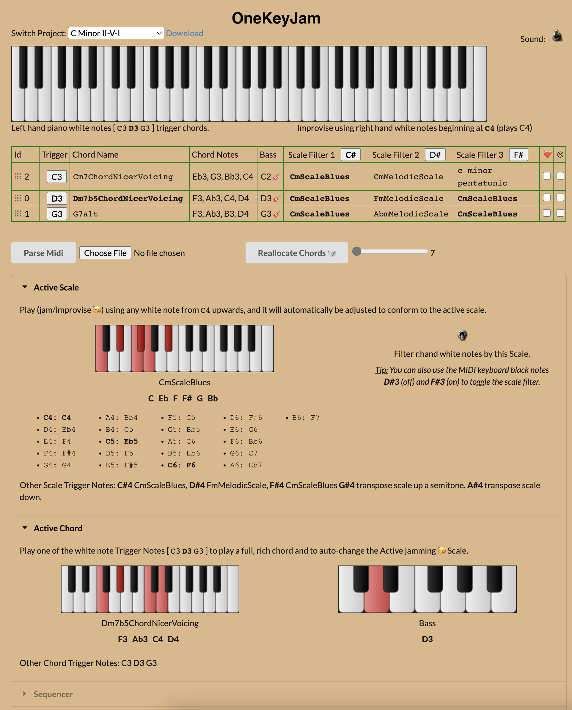
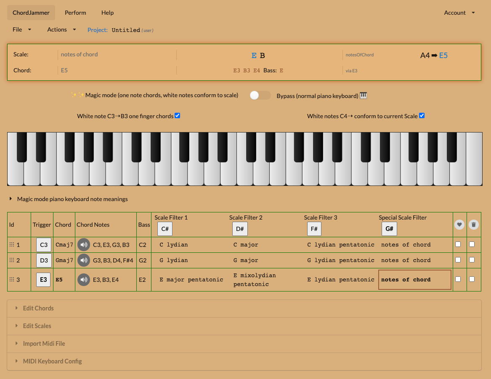
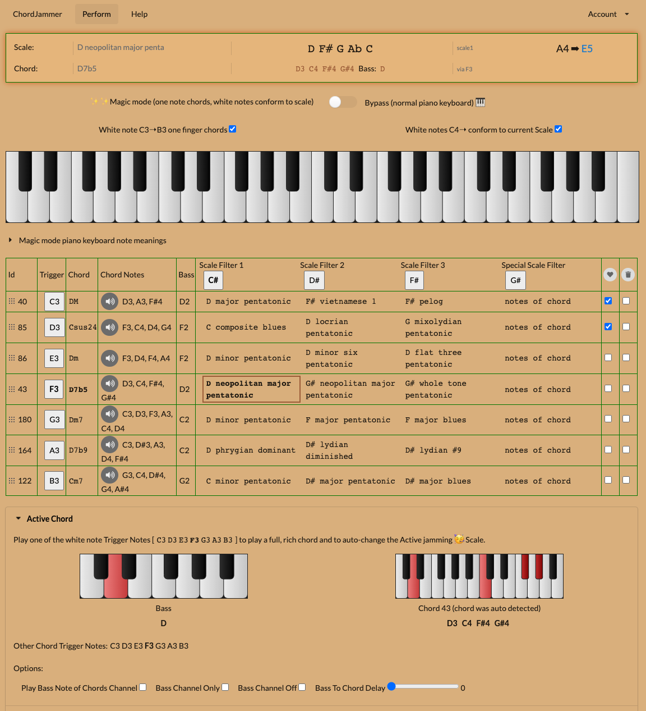
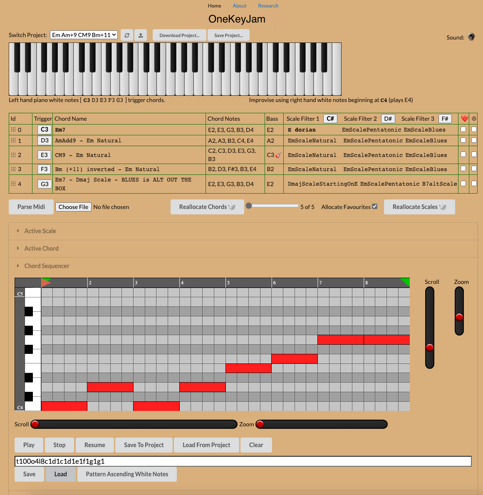
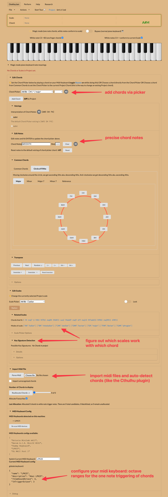

# OneKeyJam

Play chords with one finger in your left hand, and jam safely in the right hand.

OneKeyJam is a browser-based MIDI app. Left-hand notes trigger whole chords with a
single finger, and right-hand notes are filtered into the current scale, so
everything you play fits the chord. Change chord and the safe notes change with
it. It can drive a real MIDI keyboard and DAW (for example Ableton), or make the
sound in the browser.

**[Try it at onekeyjam.netlify.app](https://onekeyjam.netlify.app)**



## Features

- **Single-finger chords** - each left-hand key plays a full chord from your
  project. No chord shapes to learn.
- **Scale filtering** - right-hand notes snap to the scale that fits the current
  chord, so improvisation always sounds right.
- **Key-aware suggestions** - each project can declare its key (major, minor or
  a mode). The key fixes the scale for chords whose function matters, such as
  tritone substitutes and minor-key dominants, and keeps the alternative
  suggestions close to the key.
- **Colour dial** - choose how much chromatic colour the key keeps: `diatonic`,
  `jazz` (the default) or `adventurous`. Changing the key or colour re-ranks
  every chord scale automatically.
- **Solo in key** - flip one switch to keep the right hand on the project key
  scale while the chords change, the way many improvisers think.
- **Scale policies** - let the changes choose the scale for you. `follow
  history` continues the scale you just played and follows the chord function
  (ii-V, tritone substitute, backdoor, a full ii-V-I); `shuffle` draws a live
  scale from the top-ranked alternatives for variety. Tune the pool, dwell and
  change chance, reroll, bias by your last solo note, and watch the recent
  chord-to-scale strip. See `doco/SCALE-POLICIES.md`.
- **Key awareness demo** - a featured project that walks through a tritone
  substitute, a backdoor dominant and a borrowed bVI so you can hear the
  difference the key awareness makes.
- **Black-key modifiers** - switch scale, transpose chords and turn filtering on
  or off while you play.
- **Real MIDI, or built-in sounds** - send notes to a DAW over the macOS IAC
  Driver (jam notes, chords and bass on separate channels), or use the bundled
  General MIDI sounds in the browser.
- **Projects you control** - configure chords and scales with JSON, save projects
  in your browser, and export or import them as files.
- **Ready-made demo projects** - open a featured project and start playing
  straight away.
- **Import MIDI files** - load a MIDI file and OneKeyJam finds the chords inside
  it, then assigns them across the keyboard so you can trigger each chord with
  one note and jam over it in key. If you know [Cthulhu](https://xferrecords.com/products/cthulhu), this is the same idea.
- **Play from your computer keyboard** - if you do not have an external MIDI
  keyboard handy, click the on-screen keyboard and play it with your computer
  keys: the lower row (`z x c v b n m`) triggers the left-hand chords and the
  upper row (`q w e r t y u`) plays the solo notes.

## Using the app

1. Open the app and choose **File -> Open Featured...** or
   **File -> Open Classic...** to load a demo project. The classic library holds
   ii-V-I progressions in every key, turnarounds, blues and jazz standard
   changes.
2. Play the highlighted left-hand keys to trigger chords.
3. Play anywhere to the right to jam - the notes are filtered to fit the chord.
4. Press `1` `2` `3` `4` `5` from anywhere to switch scale1/scale2/scale3, the
   chord notes, or lock the scale. Press `0` to toggle **Solo in key** (on a
   MIDI keyboard, hold the left-hand `C#` shift and press `A#`/`Bb`). The black
   keys do the same on a MIDI keyboard, and transpose stays on the black keys.
5. Set the project key in the **Key Detection** section, and use the **Solo in
   key** checkbox and **Colour** dropdown above the chord/scale grid to shape
   the solo.

A guided tour is available from the **Start Tour** item in the menu. To build a
project from an existing MIDI file, choose **File -> Import MIDI file...** and
OneKeyJam will detect the chords and lay them out on the keyboard.

### Use a MIDI keyboard


Plug in a MIDI keyboard and Chrome connects to it automatically through the
built-in Web MIDI support - no setup needed. Sound is made in the browser out of
the box, and you can also route notes to a DAW or synth such as Ableton via the
macOS IAC Driver. MIDI needs a secure context, so the page must be served over
HTTPS (or `localhost`). See [doco/NOTES.md](doco/NOTES.md) for the full MIDI and
DAW setup.

### Play with your computer keyboard

If you do not have an external MIDI keyboard handy, you can play the on-screen
keyboard with your computer keyboard instead.

1. Click the on-screen piano keyboard once so that it has focus.
2. Trigger chords with the lower row of keys, `z x c v b n m`. These are the
   white keys of the chord trigger octave (`C3` to `B3` by default).
3. The black keys `s d g h j` in that octave are the chord modifiers (`C#`,
   `D#`, `F#`, `G#`, `A#`). Hold `s` as a shift key, and use the others to
   switch scale filtering off/on or transpose the chords.
4. Play solo notes with the upper row, `q w e r t y u`. These land in the jam
   octave (`C4` upward by default) and are filtered into the current scale.
5. Press `1` `2` `3` `4` `5` at any time to switch scale1, scale2, scale3, the
   chord notes or lock the scale. These work on every page and every octave and
   do not need the keyboard to have focus. While scale filtering is on the
   number row is only these shortcuts; when you switch scale filtering off the
   number row plays the right-hand black notes again (`2 3 5 6 7`, plus
   `9 0 - =` for the next octave).

The note keys only work while the on-screen keyboard has focus, so if typing
does nothing, click the keyboard first. The octaves follow the keyboard config
(`lhTriggerOctave`, `rhJamSoundOctave`), so a different project or keyboard may
shift the notes that each key plays.

#### Normal piano mode

Switch to **Normal piano** (the toggle next to Magic mode) to turn the keyboard
into an ordinary piano with no one-finger chords and no scale filtering. The
computer keyboard then uses the standard Ableton Live / Logic Pro layout:

- White notes: `a s d f g h j k l ;`
- Black notes: `w e t y u o p`
- `z` / `x` shift the computer keyboard down / up an octave (it starts on
  middle C). Notes outside the visible keyboard still sound, so you can keep
  shifting a few octaves in either direction.

The magic-mode overlays are replaced by these letters, and the `1`-`5` scale
shortcuts are inactive while Normal piano mode is on.

## Quick start

Requires [Node.js](https://nodejs.org/) 22.12 or later.

```sh
npm install
npm run dev
```

Then open http://localhost:8080/index.html.

## Development commands

| Command | What it does |
| --- | --- |
| `npm run dev` | Start the Vite dev server on port 8080. Generates the project and keyboard manifests first. |
| `npm run build` | Build the production site into `dist/`. |
| `npm run preview` | Serve the production build locally on port 5050. |
| `npm test` | Run the Vitest test suite once. |
| `npm run test:watch` | Run the tests in watch mode. |
| `npm run lint` | Lint with ESLint. |
| `npm run typecheck` | Type-check the JavaScript that opts in with `// @ts-check`. |
| `npm run validate:data` | Validate the static project and keyboard JSON against `schemas/`. |
| `npm run validate:scales` | Key-aware report on the scales stored in the static projects. |
| `npm run regenerate:scales` | Dry-run the engine's scale replacements (`-- --write` to apply). |
| `npm run generate:classic` | Regenerate the classic project library, keys included. |

## Project structure

- `src/views/` - the routed pages (edit/home, perform, settings, about, research).
- `src/components/` - the UI widgets, such as the keyboards and pickers.
- `src/lib/` - the framework-independent domain logic and MIDI/audio plumbing.
- `public/projects/` - featured project JSON.
- `public/keyboards/` - keyboard config JSON.
- `bin/generate-manifests.mjs` - writes the manifests that list the static
  libraries, since static hosting cannot list a directory.
- `schemas/` - JSON Schema for the static data.
- `doco/` - architecture, data model and reference documentation.

The app has no backend. Featured projects and keyboard configs are static JSON,
and projects you save live in your browser via IndexedDB. You can export and
import projects as JSON to back them up or move them between machines.

## Deployment

The app is a static site. Netlify builds it and serves `dist`, with an SPA
fallback so deep links such as `/perform` resolve to `index.html` (see
`netlify.toml`).

```sh
npm run build
npx netlify deploy --prod
```

Other hosting options are documented in [doco/NOTES.md](doco/NOTES.md).

## Documentation

- [doco/ARCHITECTURE.md](doco/ARCHITECTURE.md) - how the app is put together and
  the boot sequence.
- [doco/DATA-MODEL.md](doco/DATA-MODEL.md) - the project and keyboard data
  model, plus the validation commands.
- [doco/MUSIC-THEORY.md](doco/MUSIC-THEORY.md) - how the chord-scale engine
  works, the project key model, key-aware scoring and solo-in-key mode.
- [doco/IMPROVISING-TUTORIAL.md](doco/IMPROVISING-TUTORIAL.md) - how to
  improvise a whole performance, with song walkthroughs; also readable in the
  Help view.
- [doco/NOTES.md](doco/NOTES.md) - detailed MIDI setup, usage reference,
  deployment history and development notes.

## Screenshots



Main view, where you can edit your project.



Performance view, where you can play and record your project.



OneKeyJam has a built in sequencer, with the left-hand chords on one track and the right-hand jam notes on another.



OneKeyJam features at a glance.

## Contributing

Bug reports and feature requests are welcome in the
[issue tracker](https://github.com/abulka/onekeyjam/issues).

## License

[MIT](LICENSE) (c) Andy Bulka
