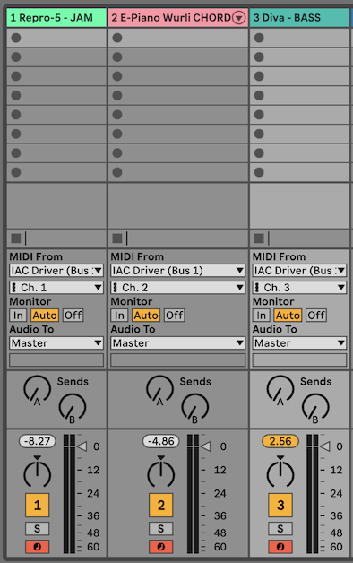
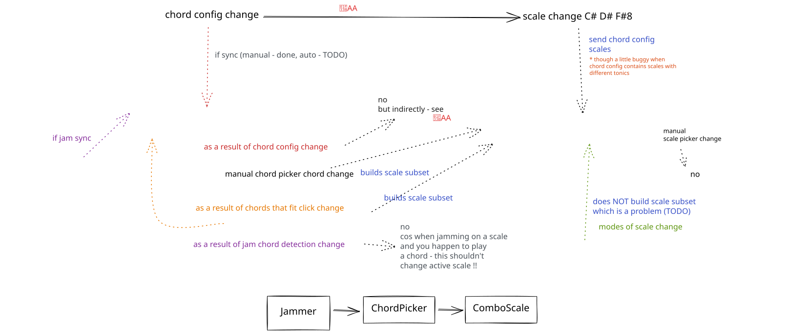

# OneKeyJam Notes

This document preserves the detailed, developer-facing and historical material
that used to live in `README.md`. It is not the place to start. New readers
should begin with `README.md`, then `ARCHITECTURE.md` and `DATA-MODEL.md`.

## Contents

- [Project history](#project-history)
- [Deploying to Netlify](#deploying-to-netlify)
- [Deploying to Heroku](#deploying-to-heroku)
- [Deploying to Dokku (NAS)](#deploying-to-dokku-nas)
- [MIDI configuration](#midi-configuration)
- [Usage detail](#usage-detail)
- [Old sample project config (deprecated)](#old-sample-project-config-deprecated)
- [Implementation notes](#implementation-notes)
- [Libraries used](#libraries-used)
- [Vue 3 template notes](#vue-3-template-notes)
- [Development TODO list](#development-todo-list)
- [Musings on a possible key signature detection website](#musings-on-a-possible-key-signature-detection-website)

## Project history

OneKeyJam is a fully client-side static site. It has no backend: the featured
project library and keyboard configs are static JSON files under `public/`, and
projects you save are kept in your browser with IndexedDB. You can export and
import projects as JSON files to back them up or move them between browsers.

OneKeyJam began as a copy of the earlier ChordJammer app, which had a server
side backend and a paid tier. OneKeyJam keeps only the client side app, so it
can be hosted for free with no billing risk.

## Deploying to Netlify

The app is a static site. Netlify builds it and serves the `dist` folder (see
`netlify.toml`). The SPA fallback redirect makes deep links such as `/perform`
resolve to `index.html`.

1. `npm run build`
2. Deploy with the Netlify CLI (`netlify deploy --prod`), or connect the Git
   repository and let Netlify run `npm run build` with `publish = dist`.

The `prebuild` script generates the manifests automatically, so no extra build
step is needed on Netlify.

## Deploying to Heroku

https://stackoverflow.com/questions/69444225/how-do-i-deploy-to-heroku-using-vite?answertab=trending#tab-top

```bash
heroku create -a onekeyjam
heroku config:set I_AM_ON_HEROKU=1
heroku buildpacks:clear
heroku buildpacks:add heroku/jvm
heroku buildpacks:add heroku/nodejs
heroku buildpacks:add https://github.com/heroku/heroku-buildpack-static.git
git push heroku main
```

The heroku-buildpack-static buildpack will make sure that your app is treated as
a static page rather than a node js application.

Add a file to the root of your Vite project called `static.json`:

```json
{
  "root": "./dist",
  "clean_urls": true,
  "routes": {
    "/**": "index.html"
  }
}
```

### Diagnostics

```
heroku buildpacks
heroku buildpacks:clear  (you can use heroku buildpacks:set xxx to both clear and then add)
heroku logs -t
heroku config
heroku run bash
```

## Deploying to Dokku (NAS)

```bash
ssh dokku.nas
dokku apps:list
dokku apps:create onekeyjam
dokku config:set onekeyjam I_AM_ON_HEROKU=1

dokku buildpacks:clear onekeyjam
dokku buildpacks:report onekeyjam
dokku buildpacks:add onekeyjam https://github.com/heroku/heroku-buildpack-jvm-common.git
dokku buildpacks:add onekeyjam heroku/nodejs
dokku buildpacks:add onekeyjam https://github.com/heroku/heroku-buildpack-static.git
```

Locally run:

```bash
git remote add nas dokku@dokku.nas:onekeyjam
git push nas main
```

Add `192.168.0.16    onekeyjam.dokku.nas` to
`%WinDir%\System32\Drivers\Etc\hosts`.

Visit http://onekeyjam.dokku.nas/

P.S. Info on [Java buildpack problems](research/dokku-java-experiments/java-attempts.md).

### Won't run sound/MIDI on NAS? No https, that's why

> Note: `navigator.requestMIDIAccess()` is only available in a secure context,
> which means your remote host must serve your resources via HTTPS. So I have to
> make my dokku NAS use https somehow.

```
dokku certs:generate onekeyjam
dokku ps:restart onekeyjam
```

See also my [private-ca-doco](research/dokku-ssl-experiments/private-ca-doco.md).

> In Microsoft Edge, you can't visit a page with a self signed certificate. Work
> around it by clicking on the page and typing the letters `thisisunsafe` - see
> this [SO solution](https://superuser.com/questions/1013670/how-to-bypass-certificate-error-in-microsoft-edge).

### Diagnostic commands for dokku

Logs:

```
dokku logs -t onekeyjam
dokku logs onekeyjam -t -p worker   <-- show just the worker (python accessing redis) logs
dokku logs onekeyjam -t -p web      <-- show just the web process (flask) logs
dokku redis:logs onekeyjam-redis  <-- shows redis logs
```

Buildpacks:

```
dokku buildpacks:report onekeyjam
dokku buildpacks:clear onekeyjam
```

Bash and diagnostics:

```
dokku run onekeyjam python -V
dokku run onekeyjam bash
dokku config:show onekeyjam     <--- shows env vars
dokku domains:report onekeyjam
dokku report onekeyjam                         <-- shows everything!
dokku ps:report onekeyjam   <-- shows how many processes are being allocated
dokku redis:list  <-- shows all the redis installations on this dokku
```

## MIDI configuration

To hear anything you need to:

- enable the `IAC Driver` using Mac's `Audio MIDI Setup` app
- run Ableton with a track with some synth sound listening only on IAC Driver
  MIDI input
  - channel 1 rh jamming notes sound
  - channel 2 chords
  - channel 3 bass

E.g.



### High CPU in MIDIServer process

Can be caused by using the IAC Driver. To fix, disable the IAC Driver and
reboot the machine.

There may be a way of fixing this - perhaps I'm using the IAC Driver wrong and
creating a `midi feedback loop`? I need to research further and play with Mac's
`Audio MIDI Setup` app wiring tool.

- https://www.logicprohelp.com/forum/viewtopic.php?t=139452
- https://www.logicprohelp.com/forum/viewtopic.php?t=73411

## Usage detail

### Single finger chords

With the project config above:

- Play C3 to trigger chord `Em7Chord` and jam in default scale `E dorian`
- Play D3 to trigger chord `AmAdd9Chord` and jam in default scale `EmScaleNatural`
- Play E3 to trigger chord `CM9Chord` and jam in default scale `EmScaleNatural`
- Play F3 to trigger chord `BmAdd11ChordInversion1` and jam in default scale `EmScaleNatural`

Jamming notes are `G3` to `C5` and are filtered to be in the default scale for
that chord.

### Scale switching whilst playing

You can switch to e.g. the pentatonic scale for the current chord by pressing
D#4. Switch back to the default scale by pressing C#4.

Here is a list of *modifier keys* and what they do to the rh scale:

- C#4 default scale, `rhnotes` in config
- D#4 `rhnotes2` scale in config
- F#4 `rhnotes3` scale in config
- G#4 transpose rh scale down by `options.transposeUpAmount` semitones,
  (defaults to 1 semitone if that option is not defined).
- A#4 transpose rh scale up by `options.transposeDownAmount` semitones,
  (defaults to 1 semitone if that option is not defined).

You can customise the transposition amounts for a given project via config e.g.

```javascript
export let project = {
    chords: {...},
    options: {
        // Override default rh. transposition amounts
        transposeUpAmount: 4,
        transposeDownAmount: -4,
        keyboard: {
            // overrides keyboard config settings, just for this project
            lhTriggerOctave: 3,
            rhJamSoundOctave: 3,
        }
    }
}
```

Potentially other customisations via config will be supported in the future:

- Being able to specify which scales to switch to, instead of pentatonic and
  blues.
- Being able to change what the modifier keys actually are (unlikely).

### Left hand black key modifiers

The octave containing the left hand chord trigger notes will have its black keys
used as modifiers. The `C#` acts as a SHIFT, so:

- `C#` hold down to engage SHIFT mode
- `D#` cmdSetScaleFiltering(false)
- `F#` cmdSetScaleFiltering(true)
- `G#` transposeChord down a semitone
- `A#` transposeChord up a semitone
- SHIFT `D#` stopAllNotes()
- SHIFT `F#` scaleFilteringModificationSticky toggle
- SHIFT `G#` reset chord transpose - todo
- SHIFT `A#` reset chord transpose - todo

### Config customisations supported

#### Scale filtering off/on

Two left-hand black keys control rh. scale mapping:

- `D#` turns scale mapping off, so white and black notes play their true
  meanings.
- `F#` turns scale mapping back on.

To get out of the scale mapping and be able to play the true meanings of the
white and black notes, hit `D#`. Hit `F#` to go back to scale filtering.

##### Discussion

You typically have pressed a single note which is mapped to a chord, which

- plays the chord
- switches on the default scale filter only allowing the notes in `rhNotes` of
  the config.

This means that:

- playing white notes will actually play different notes - only the notes from
  the scale notes in `rhNotes` will be selected
- playing black notes will act as modifiers to switch the scale (assuming you
  have defined other scales via `rhnotes2` and `rhnotes3` in the config entry
  for that chord). Those modifier keys can also transpose the scale up and down.

#### stopAllNotes

MIDI note used to stop all notes on all channels 1, 2, 3. Emergency use.

#### splitNote DEPRECATED

This is actually the 'central root note', which defines the beginning of the
scale note allocation.

- Playing to the <u>right</u> of the split note: For example, if rhnotes in the
  config begin with `['E', 'G', ...]` and `splitNote: 'C3',` then playing `C3`
  will play `E` and playing the next *white* note `D3` will play `G` etc.

- Playing to the <u>left</u> of the split note: Notes to the left of the
  splitNote are still playable jamming notes, e.g. if `splitNote: 'C3',` and
  rhnotes in the config ends with `[..., 'A']` the playing `B2` will play `A2`.
  That is, unless another special key has been assigned e.g.
  - we press a lh note that is mapped to a chord.
  - we press a lh note that is configured to be the `chordEscapeNote` or
    `stopAllNotes` key.

#### Distinguish these concepts

- jam trigger note and octave
- jam octave starts at
- jam scale note starts at
- jam scale notes
- Scale filtering / mapping { jam trigger note incl. octave -> jam scale note
  incl. octave }
- jamoctavestartsat floats up depending on the number of lh trigger notes and
  rounded to the next octave and is thus calculated.

#### rhJamSoundOctave

To which octave to start mapping notes to, starting from the split note e.g. If
the r.h plays `C4` it might be mapped to `E3` if `rhJamSoundOctave` is `3` and
the rhnotes in the config begin with `['E', ...]`.

### Multiple configs

Just edit the config and name `project` to be the current config you want.
Older configs can be renamed to e.g. `projectOld` which are then offline.

A better system allowing switching configs will be built in the future.

### Future config file format changes

Many root level config entries will probably be moved into the `options`
sub-dictionary.

Some might could go into a special `options.modifierKeys` area.

There will also be a GUI to manage the config rather than dealing with JSON.

## Old sample project config (deprecated)

```javascript
export let project = {
    chords: {
        'C3': {
            lhchord: Em7Chord,
            rhnotes: "E dorian",
        },
        'D3': {
            lhchord: AmAdd9Chord,
            rhnotes: EmScaleNatural,
        },
        'E3': {
            lhchord: CM9Chord,
            rhnotes: EmScaleNatural,
        },
        'F3': {
            lhchord: BmAdd11ChordInversion1,
            rhnotes: EmScaleNatural,
            rhnotes2: EmScaleHarmonic,
            rhnotes3: EmBlues,
        }
    }
}
```

## Implementation notes

For miscellaneous learnings on how to use the Webmidi.js library for this
project, see `implementation-notes.md`.

## Libraries used

- MIDI powered by [WebMidi.js](https://webmidijs.org/docs/)
- GUI powered by
  [webaudio-controls](http://g200kg.github.io/webaudio-controls/docs/index.html)
- Scales powered by [tonaljs](https://github.com/tonaljs/tonal) - A functional
  music theory library for Javascript.
- Sound Fonts by [webaudiofont](https://github.com/surikov/webaudiofont)
- [@tonejs/midi](https://github.com/Tonejs/Midi) - for making synth sounds and
  parsing midi
- [@tonaljs/tonal](https://github.com/tonaljs/tonal) - for notes, scales and
  chords

## Vue 3 template notes

This project was started from the Vue 3 + Vite template.

### Recommended IDE setup

[VSCode](https://code.visualstudio.com/) +
[Volar](https://marketplace.visualstudio.com/items?itemName=johnsoncodehk.volar)
(and disable Vetur) + [TypeScript Vue Plugin
(Volar)](https://marketplace.visualstudio.com/items?itemName=johnsoncodehk.vscode-typescript-vue-plugin).

### Customize configuration

See [Vite Configuration Reference](https://vitejs.dev/config/).

### Project setup

```sh
npm install
```

#### Compile and hot-reload for development

```sh
npm run dev
```

#### Compile and minify for production

```sh
npm run build
```

#### Run unit tests with [Vitest](https://vitest.dev/)

```sh
npm test
```

Use `npm run test:watch` for watch mode while developing.

## Development TODO list

- clicking on modes of scale
  - `setScale()` does not exist in ChordPicker - yet is called by the url
    click. There is a `setScale()` in ComboScale.vue - need to think about
    communication etc.
  - Only 3 scales shown in scale combo when via chord trigger. Want ALL
    compatible chords.
  - Bb needs to be converted to A# to cause combo box to match
  - if scale not in combo then need to switch to show all chords mode in the
    combo
  - also C13 suggests lydian dom, mixo, bepop but composite blues, dorian #4,
    dorian are in the scales dropdown?

- need way to reset r.h. transpositions - the midi way is too subtle.
  - checkbox to indicate r.h transposition has happened
  - turning off checkbox will reset transpositions

- lh black shifter needs to behave normally in bypass mode.
  - Perhaps remove the magic shift state behaviour - logic too complex and use
    an onscreen UI button instead to:
    - panic (stop all notes)
    - reset lh. transpositions
    - we already have a way to turn scale filter on/off

- active scale area needs attention
  - scale trigger maps - if too many chords allocated for the keyboard, the
    scale allocation notes are so high the they get rejected and the scale map
    becomes empty. Check this by looking at Active Scale.
  - scale filter toggle not in sync?
  - current scale not being show properly on piano
  - etc.

- add bass note to hand editing input
- `Uncaught (in promise) Cannot find '7#5sus4' chord combo options`
  (anonymous) @ ChordPicker.vue:197 because not stripping bass note
- arguably set combo box for current chord when hand edit notes

## chord-scale-interactions.excalidraw.svg



## Musings on a possible key signature detection website

Single Page Application:

- PAGE1 - detect key signature from chords via a chord picker
  - add chords to a list
  - paste a list of TonalJs chord symbols in
- PAGE2 - detect key signature from notes
  - paste a list of TonalJs notes in
  - also allows music21 to detect key signature
  - [optionally] run java tension key signature detection (ask for permission?)
- PAGE3 - detect key signature from MIDI file
  - runs my chord detect algorithm on the MIDI file, generating a list of
    chords incl. notes
  - can then run either the note or chord based detection algorithm on the list
    of chords/notes

### Deployment

key-signature-detect.atug.com
key-signature-detect.heroku.com

- Might as well use vite for this. Static website.
- Flask & Python needed for the music21 work.
  - Serve the static vite website from flask.
- Java needed for the [optional] tension
  - don't need a worker for this, simply invoke the java program from the
    command line using Python and read stdout
  - ignore the generated files. Possibly run in a temporary directory to avoid
    clogging the server home directory.
- Thus don't need a worker process at all, just a flask server web process.
  - buildpack for java jvm
  - buildpack for nodejs which will compile the vite stuff with nodejs using
    `npm run build`
  - buildpack for python/flask which will actually be the web process - a flask
    server
- Google Ads $$
- Ads for OneKeyJam $$

### Existing websites

- http://musictheorysite.com/namethatkey/
  - click on the chords - easy to use!
- Scaler-2
  https://www.pluginboutique.com/product/3-Studio-Tools/93-Music-Theory-Tools/6439-Scaler-2
  - $59
- Audio based
  - https://getsongkey.com/tools/key-finder
    - mp3 to key
    - good educational content
  - https://tunebat.com/Analyzer
    - mp3
    - subscription model
